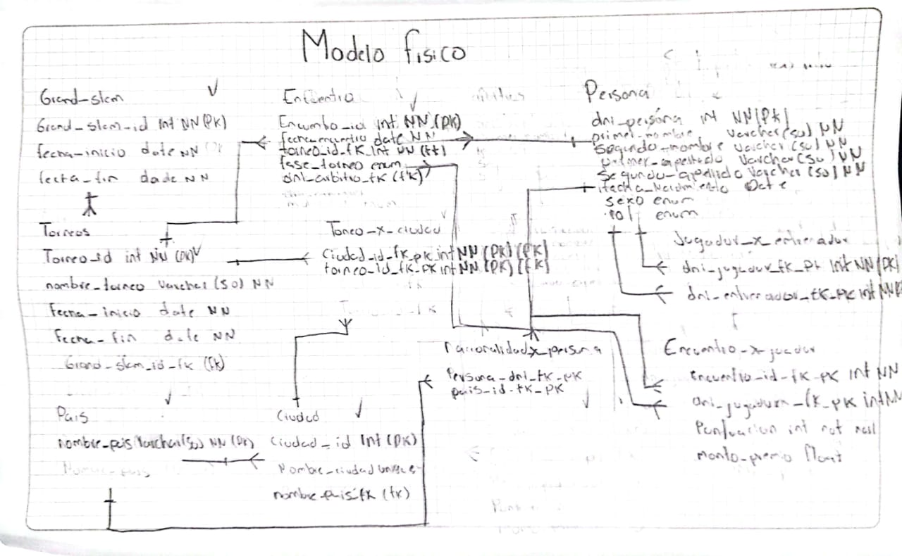

# proyecto filtro Tenis Grand Slam Examen


## colaboradores del repositorio .
+ campus lands **(trainer)**
+ juan david guiza garcia **(camper)**


## Objectivo del proyecto
almacenar de manera integral la información de todos los encuentros que han tenido lugar desde el inicio del torneo


## como clonar el repositorio 
```
git clone https://github.com/JUANDGG/TenisGrandSlamExamen.git
```


## como aparece la base de datos en el cluster
```
use TenisGrandSlamExamen ;
show tables ;
```

## **Modelo conceptual**

El sistema debe almacenar de manera integral la información de todos los encuentros que han tenido lugar desde el inicio del torneo, incluyendo diversas características asociadas. En el contexto del Grand Slam, que consta de cuatro torneos anuales celebrados en Gran Bretaña, Estados Unidos, Francia y Australia, es importante considerar que cada país puede albergar el torneo en diferentes ubicaciones, como Forest Hill o Flashing Meadows en EE. UU.

Cada partido está vinculado a un premio de consolación para el perdedor, cuyo monto depende de la fase del torneo en la que se encuentre (por ejemplo, el perdedor de octavos de final puede recibir 5,000 dólares). El ganador de la final, por su parte, obtendrá el premio correspondiente al torneo. Además, se deben contemplar cinco modalidades de juego en cada torneo: Individual masculino, individual femenino, dobles masculino, dobles femenino y dobles mixtos.

Es esencial tener en cuenta la nacionalidad de los jugadores, ya que estos pueden ser apátridas o tener múltiples nacionalidades.


## **Modelo logico**

#### Tabla gran_slam
+  grand_slam_id INT NOT NULL (pk) ,
+  fecha_inicio DATE NOT NULL ,
+ echa_fin DATE NOT NULL


#### Tabla  torneo 

+ torneo_id INT not null (pk) ,
+ nombre_torneos VARCHAR(50) not null , 
+ fecha_inicio DATE not NULL,
+ fecha_fin DATE not NULL , 
+ grand_slam_id_fk INT not null (fk),
+ modalidad_torneo enum('individual masculino', 'individual femenino', 'dobles masculino', 'dobles femenino', 'dobles mixtos')


#### Tabla encuentro 

+ encuentro_id int not null (pk),
+ fecha_encuentro date not null  ,
+ torneo_id_fk int not null (fk),
+ fase_torneo enum('octavos','cuartos','semifinal','final') not null ,
+ dni_arbitro_fk int not null (fk)


#### Tabla torneo_x_ciudad 
+  ciudad_id_fk_pk int not null (pk) (fk),
+  torneo_id_fk_pk int not null  (pk) (fk)


#### Tabla pais 
+ nombre_pais VARCHAR(50) not null (pk)


#### Tabla ciudad

+ ciudad_id int not null (pk) ,
+ nombre_ciudad VARCHAR(50) not null (unique),
+ nombre_pais_fk VARCHAR(50) not null

#### Tabla persona 
+ dni_persona int not null  (pk) ,
+ primer_nombre varchar(50) not null  ,
+ segundo_nombre VARCHAR(50) null ,
+ primer_apellido varchar(50) not null , 
+ segundo_apellido VARCHAR(50) null ,
+ fecha_nacimiento DATE not null  ,
+ sexo enum('mujer','hombre') not null ,
+ rol enum ('entrenador','jugador','arbitro') not null


#### Tabla jugador_x_entrenador 
+ dni_jugador_fk_pk int not null ,
+ dni_entrenador_fk_pk int not null 

#### Tabla nacionalidad_persona 
+  persona_dni_fk_pk int not null  ,
+  nombre_pais_fk_pk VARCHAR(50) not null 


#### Tabla encuentro_x_jugador 
 + encuentro_id_fk_pk int not null  ,
 + dni_jugador_fk_pk int not null ,
 + puntuacion int not null ,
 + monto_premio float not null 

## Modelo fisico 




## Consultas


1. Dado un año y un torneo, composición y resultado de los partidos.

    ```sql
      # Consulta Aqui
    ```

2. Lista de árbitros que participaron en el torneo.

    ```sql
      # Consulta Aqui
    ```

3. Ganancias percibidas en premios por un jugador a lo largo del torneo.

    ```sql
      # Consulta Aqui
    ```

4. Lista de entrenadores que han entrenado a un jugador a lo largo del torneo y fechas en las que lo hizo.

    ```sql
      # Consulta Aqui
    ```

5. Connors gano Gerulaitis en Roland Garros en 1979 en cuartos de final en individuales masculinos por 6-3 4-6/7-5 6-0.

    ```sql
      # Consulta Aqui
    ```

6. El señor Wilkinson arbitro ese partido.

    ```sql
      # Consulta Aqui
    ```

7. Alemania ha ganado dos veces las individuales masculinas de Wimbledon. Borg ha ganado 2.000.000 de dólares a lo largo de su participación en el Grand Slam.

    ```sql
      # Consulta Aqui
    ```

8. El ganador de Roland Garros de 1987 ganó 20.000 dólares.

    ```sql
      # Consulta Aqui
    ```

9. Noah ha jugado cuatro veces en dobles mixtos con Mandlikova.

    ```sql
      # Consulta Aqui
    ```
