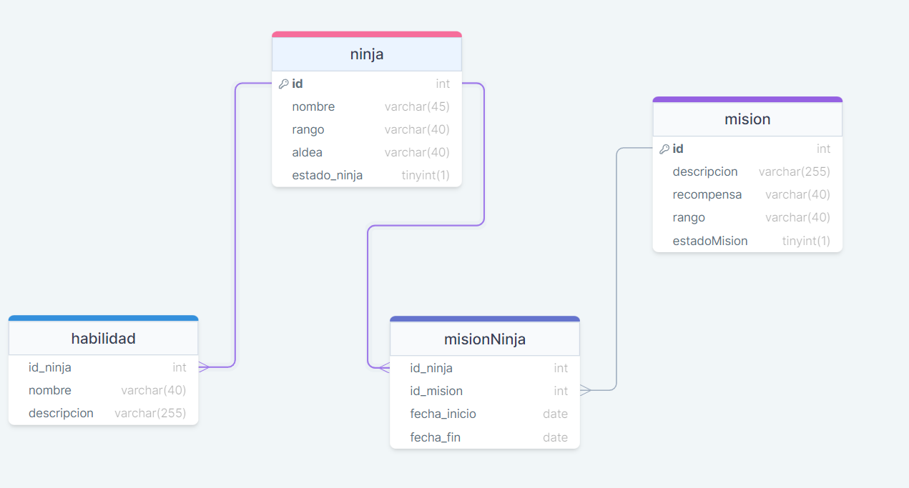
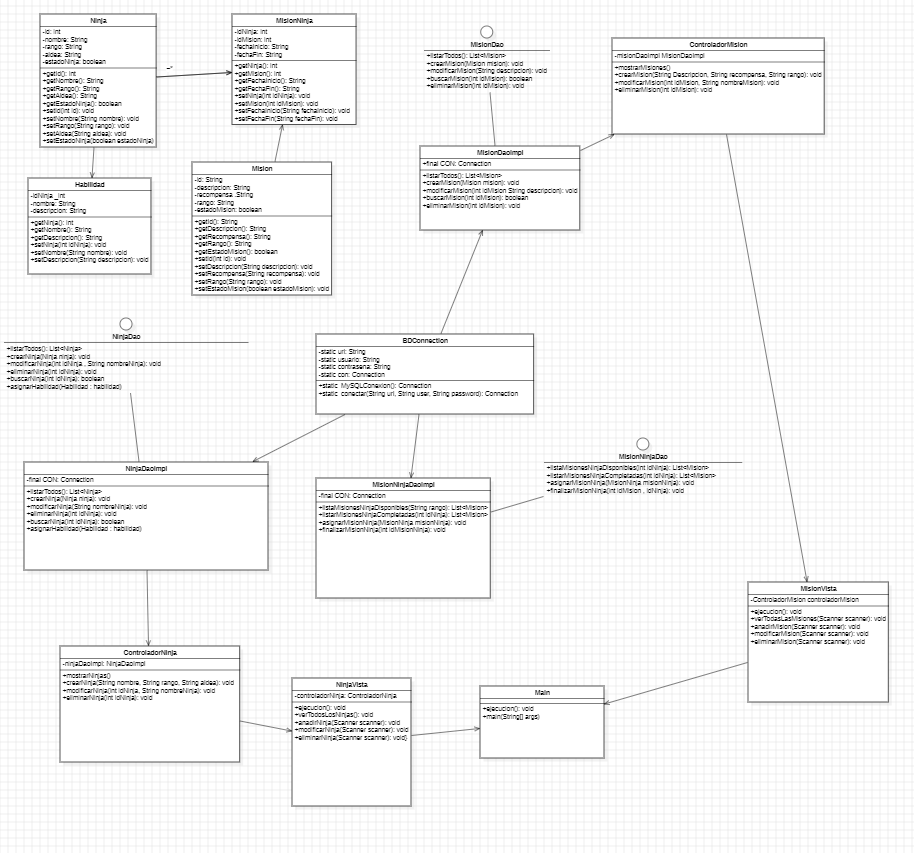

# Gestion de datos naruto 


## De que trata  el repositorio

Modernizar sistema de gestion de misiones y datos de los ninjas

## Objetivo del repositorio 
Crear una sistema de gestion de misiones 
y gestionar de manera eficiente los datos de los ninjas

## Alerta 🙆‍♂️

Antes de ver el contenido de mi repositorio por favor dejame dejarte ciertos aspectos claros en el mismo como primero en los requirimientos no me pedia de ninguna manera la gestion de ninjas o de misiones como tal 

estas eran los requerimiento bases :

- Listar todos los ninjas junto con sus habilidades
- Mostrar las misiones disponibles para un ninja especifico 
- Mostrar misiones completadas para un ninja en especifico
- Asignar una mision a un ninja , registrado la fecha de inicio
- Marcar una mision como completada registrando la fecha de finalizacion 
- Mostrar todas las misiones completadas


yo decidi ir un poco mas , el sistema no pide esto pero yo nesesitaria implementarle para que le sistema este mucho mejor estruturado

estos fueron los requerimientos que añadi :

- crud ninja 
- crud mision


## Modelo fisico base de datos


## Modelado de clases uml
**Modificaciones que hice despues de las 9 en el diagrama uml :**
En el diagrama uml hice una pequeño cambio en la clase habilidad la 
cual getteaba y seteaba un objecto de tipo Ninja el cual cambie por un entero 




## Script de creacion de la base de datos a utilizar


```sql
DROP DATABASE IF EXISTS naruto_juanGuiza ;
CREATE DATABASE naruto_juanGuiza ;

CREATE TABLE misionNinja(
    id_ninja INT  NOT NULL,
    id_mision INT NOT NULL,
    fecha_inicio DATE NOT NULL,
    fecha_fin DATE NULL 
);
CREATE TABLE mision(
    id INT  NOT NULL AUTO_INCREMENT PRIMARY KEY,
    descripcion VARCHAR(255) NOT NULL,
    recompensa VARCHAR(40) NOT NULL,
    rango VARCHAR(40) NOT NULL,
    estadoMision TINYINT NOT NULL 
);
CREATE TABLE habilidad(
    id_ninja INT  NOT NULL ,
    nombre VARCHAR(40) NOT NULL,
    descripcion VARCHAR(255) NOT NULL
);
CREATE TABLE ninja(
   	id INT  NOT NULL AUTO_INCREMENT PRIMARY KEY,
    nombre VARCHAR(45) NOT NULL,
    rango VARCHAR(40) NOT NULL,
    aldea VARCHAR(40) NOT NULL,
    estado_ninja TINYINT NOT NULL 
);


ALTER TABLE
    `misionNinja` ADD CONSTRAINT `misionninja_id_ninja_foreign` FOREIGN KEY(`id_ninja`) REFERENCES `ninja`(`id`);
ALTER TABLE
    `misionNinja` ADD CONSTRAINT `misionninja_id_mision_foreign` FOREIGN KEY(`id_mision`) REFERENCES `mision`(`id`);
ALTER TABLE
    `habilidad` ADD CONSTRAINT `habilidad_id_ninja_foreign` FOREIGN KEY(`id_ninja`) REFERENCES `ninja`(`id`);

INSERT INTO ninja (nombre,rango,aldea,estado_ninja) 
VALUES 
("juan david" ,"rango1","aldea1", true) 
,("el pepe" ,"rango2","aldea2", false) 
,("el gonzalo" ,"rango1","aldea3",true)
,("goku" ,"rango2","aldea4",false)
,("naruto" ,"rango1","aldea5",true)
;

INSERT into habilidad (id_ninja ,nombre,descripcion)
VALUES 
(1 ,"super inteligencia" ,"habilidad de inteligencia")
,(2,"super fuerza","habilidad de super fuerza")
,(3,"super velocidad","habilidad de super velocidad")
,(4,"super estamina","habilidad de super estamina")
,(5,"volar","habilidad de volar") ;


INSERT into mision (descripcion,recompensa,rango,estadoMision)
VALUES 
("mision1","trofeo1","rango1",true)
,("mision2","trofeo2","rango2",false);


INSERT into misionNinja (id_ninja,id_mision,fecha_inicio,fecha_fin)
VALUES
(1,1 ,"2024-01-29",null)
,(3,1,"2024-01-29",null)
,(5,1,"2024-01-29",null)
,(2,2,"2022-01-29","2023-01-28")
,(4,2,"2021-01-29","2022-01-28");

```


## Como clonar el repositorio

```
https://github.com/JUANDGG/naruto_juanGuiza.git
```


## Como colaborar 
para colaborar me puedes escribir al siguiente correo


```
juanguiza65@gmail.com
```
