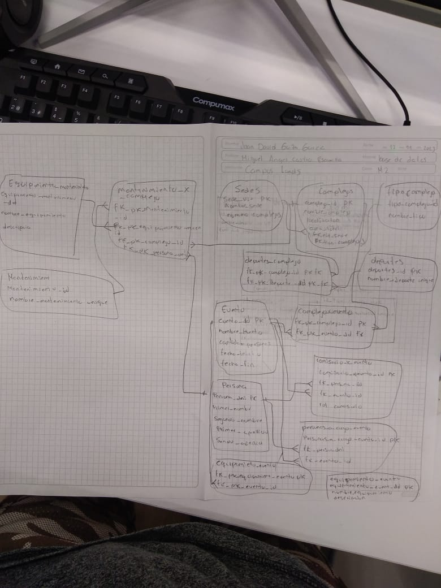

# Evaluacion  2 olimpiada evaluacion


## Objectivo del repositorio
optimización integral de los recursos y espacios en las sedes olímpicas, particularmente en los complejos polideportivos, para lograr una gestión eficiente y exitosa de los eventos deportivos.

## ¿como aparece en el cluster ?

`olimpiadaEvaluacion`

## !importante : 
"la base de datos del cluster no cuenta con inserciones"


## Como clonar el repostiorio
```
https://github.com/JUANDGG/olimpiadaEvaluacion.git
```


## Modelo conceptual :
****Surge la problemática de optimizar el uso de espacios en los complejos polideportivos. Dada la subdivisión de complejos deportivos en aquellos destinados a un único deporte y los polideportivos, es esencial garantizar una distribución eficiente de las áreas designadas para cada deporte en los complejos polideportivos.

La pregunta clave es, cómo maximizar la utilización de los espacios disponibles en los complejos polideportivos, considerando las diferentes áreas destinadas a distintos deportes con indicadores de localización específicos. La optimización deberá tener en cuenta la variedad de deportes que se celebran en un mismo complejo polideportivo, garantizando la eficacia en la organización de eventos y minimizando posibles conflictos de programación.

Además, la gestión de eventos en cada complejo añade complejidad al escenario. ¿Cómo asegurar que los eventos programados en una sede no entren en conflicto con la disponibilidad de áreas específicas en los complejos polideportivos? Esto implica coordinar fechas, duraciones, participantes y comisarios de manera eficiente, evitando superposiciones y garantizando un flujo adecuado de las actividades deportivas.

La necesidad de mantener una lista actualizada de comisarios y su participación en eventos plantea otra dimensión de la problemática. ¿Cómo gestionar eficazmente la asignación de comisarios a eventos específicos, considerando sus roles como jueces u observadores, para asegurar una cobertura adecuada en cada competición?

Finalmente, la gestión del equipamiento necesario para eventos y mantenimiento también representa un desafío. ¿Cómo garantizar que cada evento cuente con el equipamiento requerido y que se realice un mantenimiento efectivo de las instalaciones sin afectar la realización de competiciones?

La problemática central radica en la optimización integral de los recursos y espacios en las sedes olímpicas, particularmente en los complejos polideportivos, para lograr una gestión eficiente y exitosa de los eventos deportivos.


1. **Complejos Deportivos:**
    - Los complejos deportivos están especializados en un único deporte.
    - Cada complejo deportivo tiene una localización específica, un jefe de organización individual y un área total ocupada.
2. **Complejos Polideportivos:**
    - Los complejos polideportivos albergan múltiples deportes, con áreas designadas para cada uno y un indicador de localización.
    - Al igual que los complejos deportivos, los polideportivos tienen una localización, un jefe de organización individual y un área total ocupada.
3. **Información Específica para Cada Tipo de Sede:**
    - Se mantiene información específica para cada tipo de sede, como el número de complejos y su presupuesto aproximado.
4. **Eventos en los Complejos:**
    - Cada complejo, ya sea deportivo o polideportivo, celebra eventos.
    - Para cada evento se registra información detallada, incluyendo fecha, duración, número de participantes y número de comisarios.
5. **Comisarios y su Involucramiento en Eventos:**
    - Se mantiene una lista de todos los comisarios, identificando si desempeñan el papel de juez u observador en cada evento.
    - La relación entre comisarios y eventos se registra para rastrear su participación específica.
6. **Equipamiento Necesario:**
    - Tanto para eventos como para el mantenimiento de los complejos, se requiere cierto equipamiento específico, como arcos, pértigas, barras paralelas, etc.


## Modelo logico :


### equipamiento_evento

equipamiento_evento_id (PK)
nombre_equipamiento
descripcion


### deportes
deportes_id (PK)
nombre_deporte (Unique)


### mantenimiento
mantenimiento_id (PK)
nombre_mantenimiento (Unique)


### complejo_x_evento
fk_pk_complejo_id (PK, FK)
fk_pk_evento_id (PK, FK)

### deportes_x_complejo
fk_pk_complejo_id (PK, FK)
fk_pk_deportes_id (PK, FK)

### mantenimiento_x_complejo
fk_pk_mantenimiento_id (PK, FK)
fk_pk_equipamiento_mantenimiento_id (PK, FK)
fk_pk_complejo_id (PK, FK)
fk_pk_persona_dni (PK, FK)


### comisario_x_evento

comisario_x_evento_id (PK)
fk_persona_id (FK)
fk_evento_id (FK)
rol_comisario

### persona

persona_dni (PK)
primer_nombre
segundo_nombre
primer_apellido
segundo_apellido

### equipamiento_mantenimiento

equipamiento_mantenimiento_id (PK)
nombre_equipamiento
descripcion

### personas_a_cargo_evento

personas_a_cargo_evento_id (PK)
fk_persona_dni (FK)
fk_evento_id (FK)

### equipamiento_x_evento
fk_pk_equipamiento_eventos_id (PK, FK)
fk_pk_evento_id (PK, FK)

### sedes

sede_nit (PK)
nombre_sede
numero_complejos

### complejo

complejo_id (PK)
nombre_complejo
localizacion
area_total
fk_nit_sede (FK)
fk_tipo_complejo_id (FK)

### evento

evento_id (PK)
nombre_evento
cantidad_de_personas
fecha_inicio
fecha_fin

### tipo_complejo

tipo_complejo_id (PK)
nombre_tipo


## Modelo fisico :

## Modelo fisico Escrito


## Modelo fisico draw sql

