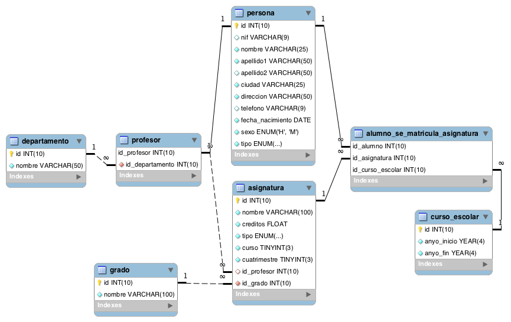

# Primera evaluacion ciclo `mysql`

## Modelo fisico



## Objectivo del repositorio 
generar queris sql para la posterior consulta de la base de datos las cuales son parte de la evaluacion asignada por el trainer

### Como aparece la base de datos en el cluter 

`universidadEvaluacion`


### Como clonar el repositorio 

```
git clone https://github.com/JUANDGG/universidadEvaluacion.git
```


## **Consultas  sql**

1. Devuelve un listado con el primer apellido, segundo apellido y el nombre de todos los alumnos. El listado deberá estar ordenado alfabéticamente de menor a mayor por el primer apellido, segundo apellido y nombre.

```sql


  DELIMITER // 
  create PROCEDURE if not EXISTS listar_alumnos_ordenados()
  BEGIN

    SELECT 
    apellido1 AS primer_apellido,
    IF(apellido2 IS NULL OR LENGTH(apellido2) = 0, 'no tiene segundo apellido', apellido2) AS segundo_apellido,
    nombre AS nombre_empleado    
    FROM persona 
    WHERE tipo = 'alumno' 
    ORDER BY UPPER(apellido1) ASC, UPPER(apellido2) ASC, UPPER(nombre) ASC;

  END //

  DELIMITER ;

  CALL listar_alumnos_ordenados();

```

2. Averigua el nombre y los dos apellidos de los alumnos que **no** han dado de alta su número de teléfono en la base de datos.

```sql
    
    DELIMITER // 
    CREATE PROCEDURE IF NOT EXISTS obtener_alumnos_sin_telefono ()
    BEGIN
    SELECT 
        nombre as nombre_alumno ,
        apellido1 as primer_apellido , 
        if(apellido2 is null or length(apellido2)=0 , 'no tiene apellido materno' , apellido2) as segundo_apellido
        from persona WHERE tipo = 'alumno' and (telefono is null or length(telefono) = 0 );
    END // 
    DELIMITER ;

    CALL obtener_alumnos_sin_telefono ();


```

3. Devuelve el listado de los alumnos que nacieron en `1999`.

```sql
    
    DELIMITER // 
    CREATE PROCEDURE IF NOT EXISTS obtener_alumnos_nacidos_en_1999()
    BEGIN
      SELECT * from persona WHERE tipo = 'alumno' and YEAR(fecha_nacimiento) =1999;
    END // 
    DELIMITER ;

    CALL obtener_alumnos_nacidos_en_1999();
```

4. Devuelve el listado de `profesores` que **no** han dado de alta su número de teléfono en la base de datos y además su nif termina en `K`.

```sql

DELIMITER // 
CREATE PROCEDURE IF NOT EXISTS obtener_profesores_sin_telefono_y_nif_k()

BEGIN
    SELECT 
    *
    from persona WHERE nif
    LIKE '%k' and
    tipo = 'profesor' and (telefono is null or length(telefono) =0 );
END // 

DELIMITER ;

CALL obtener_profesores_sin_telefono_y_nif_k() ;


```

5. Devuelve el listado de las asignaturas que se imparten en el primer cuatrimestre, en el tercer curso del grado que tiene el identificador `7`.

```sql

DELIMITER // 
CREATE PROCEDURE IF NOT EXISTS asignaturas_cuatrimestre_3_grado_7()

BEGIN
   select 
    * 
    from asignatura asg
    where asg.cuatrimestre =1 and asg.curso =3 and asg.id_grado =7 ;
END // 

DELIMITER ;

CALL asignaturas_cuatrimestre_3_grado_7() ;

```

6. Devuelve un listado con los datos de todas las **alumnas** que se han matriculado alguna vez en el `Grado en Ingeniería Informática (Plan 2015)`.

```sql

DELIMITER // 
CREATE PROCEDURE IF NOT EXISTS alumnas_ing_informatica_plan_2015()

BEGIN
    SELECT  pr.* from persona pr 
    JOIN alumno_se_matricula_asignatura  asma on pr.id =asma.id_alumno 
    JOIN asignatura asg on asma.id_asignatura = asg.id  
    JOIN grado gr on asg.id_grado =gr.id
    where (gr.nombre = 'Grado en Ingeniería Informática (Plan 2015)' and pr.sexo = 'm');
END // 

DELIMITER ;

CALL alumnas_ing_informatica_plan_2015() ;

```

7. Devuelve un listado con todas las asignaturas ofertadas en el `Grado en Ingeniería Informática (Plan 2015)`.

```sql

DELIMITER // 
CREATE PROCEDURE IF NOT EXISTS asignaturas_ing_informatica_2015()

BEGIN
    SELECT  * FROM asignatura asg
    JOIN grado gr on asg.id_grado = gr.id 
    WHERE gr.nombre ='Grado en Ingeniería Informática (Plan 2015)';
END // 

DELIMITER ;

CALL asignaturas_ing_informatica_2015() ;

```

8. Devuelve un listado de los `profesores` junto con el nombre del `departamento` al que están vinculados. El listado debe devolver cuatro columnas, `primer apellido, segundo apellido, nombre y nombre del departamento.` El resultado estará ordenado alfabéticamente de menor a mayor por los `apellidos y el nombre.`

```sql

DELIMITER // 
CREATE PROCEDURE IF NOT EXISTS profesores_con_departamento()

BEGIN
    SELECT 
    pr.apellido1 as primer_apellido,
    pr.apellido2 as segundo_apellido,
    pr.nombre as nombre_profesor ,
    dp.nombre as nombre_departamento
    FROM profesor pf
    JOIN persona pr ON pf.id_profesor  = pr.id
    JOIN  departamento dp ON pf.id_departamento = dp.id
    ORDER BY pr.nombre ASC , pr.apellido1 ASC,pr.apellido2 ASC;
END // 

DELIMITER ;

CALL profesores_con_departamento() ;

```

9. Devuelve un listado con el nombre de las asignaturas, año de inicio y año de fin del curso escolar del alumno con nif `26902806M`.

```sql

DELIMITER // 
CREATE PROCEDURE IF NOT EXISTS asignaturas_alumno_nif()

BEGIN
    SELECT  
    asg.nombre as nombre_asignatura ,
    ce.anyo_inicio ,
    ce.anyo_fin
    from  alumno_se_matricula_asignatura asma 
    JOIN asignatura asg  on  asma.id_asignatura = asg.id
    JOIN persona pr on asma.id_alumno = pr.id
    JOIN curso_escolar ce on asma.id_curso_escolar = ce.id
    WHERE pr.nif  = '26902806M' and pr.tipo = 'alumno';
END // 

DELIMITER ;

CALL asignaturas_alumno_nif() ;

```

10. Devuelve un listado con el nombre de todos los departamentos que tienen profesores que imparten alguna asignatura en el `Grado en Ingeniería Informática (Plan 2015)`.

```sql

DELIMITER // 
CREATE PROCEDURE IF NOT EXISTS deptos_con_profesores_ing_informatica_2015()

BEGIN
    SELECT dp.nombre  FROM  departamento dp 
     JOIN profesor pf on dp.id = pf.id_departamento
     JOIN asignatura asg on pf.id_profesor  = asg.id_profesor
     JOIN grado gr on asg.id_grado = gr.id 
     WHERE gr.nombre = 'Grado en Ingeniería Informática (Plan 2015)' GROUP by dp.nombre;
END // 

DELIMITER ;

CALL deptos_con_profesores_ing_informatica_2015() ;

```

11. Devuelve un listado con todos los alumnos que se han matriculado en alguna asignatura durante el curso escolar 2018/2019.

```sql

DELIMITER // 
CREATE PROCEDURE IF NOT EXISTS alumnos_matriculados_2018_2019()

BEGIN
    select DISTINCT
    pr.*
    from alumno_se_matricula_asignatura asma
    JOIN persona pr on asma.id_alumno = pr.id
    JOIN curso_escolar ce on asma.id_curso_escolar = ce.id
    WHERE ce.anyo_inicio = 2018  and ce.anyo_fin = 2019 ;
END // 

DELIMITER ;

CALL alumnos_matriculados_2018_2019() ;

```

12. Devuelve un listado con los nombres de **todos** los profesores y los departamentos que tienen vinculados. El listado también debe mostrar aquellos profesores que no tienen ningún departamento asociado. El listado debe devolver cuatro columnas, nombre del departamento, primer apellido, segundo apellido y nombre del profesor. El resultado estará ordenado alfabéticamente de menor a mayor por el nombre del departamento, apellidos y el nombre.

```sql
DELIMITER // 
CREATE PROCEDURE IF NOT EXISTS profesores_con_departamentos()

BEGIN
    SELECT
    pr.apellido1 as primer_apellido,
    pr.apellido2 as segundo_apellido,
    pr.nombre as nombre_profesor ,
    if((dp.nombre =null or length (dp.nombre) =0 ),'no tiene departamento',dp.nombre )AS nombre_departamento
    from profesor pf
    JOIN persona pr on  pf.id_profesor = pr.id
    LEFT JOIN departamento dp on pf.id_departamento =dp.id ;  
END // 

DELIMITER ;
CALL profesores_con_departamentos() ;
```

13. Devuelve un listado con los profesores que no están asociados a un departamento.Devuelve un listado con los departamentos que no tienen profesores asociados.

```sql
  # Consulta Aqui
```

14. Devuelve un listado con los profesores que no imparten ninguna asignatura.

```sql
DELIMITER // 
CREATE PROCEDURE IF NOT EXISTS profesores_sin_asignaturas ()

BEGIN
    SELECT per.* 
    FROM persona per 
    WHERE per.id IN (
    SELECT prf.id_profesor 
    FROM profesor prf
    WHERE  prf.id_profesor
    NOT IN (
    SELECT asg.id_profesor 
    FROM asignatura asg
    WHERE asg.id_profesor IS NOT NULL
	)
);
END // 

DELIMITER ;

CALL profesores_sin_asignaturas () ;
```

15. Devuelve un listado con las asignaturas que no tienen un profesor asignado.

```sql

DELIMITER // 
CREATE PROCEDURE IF NOT EXISTS asignaturas_sin_profesor()

BEGIN
   	select  
    * 
    from asignatura asg 
    WHERE asg.id_profesor is null or LENGTH(asg.id_profesor) = 0 ;
END // 

DELIMITER ;

CALL asignaturas_sin_profesor() ;
```

16. Devuelve un listado con todos los departamentos que tienen alguna asignatura que no se haya impartido en ningún curso escolar. El resultado debe mostrar el nombre del departamento y el nombre de la asignatura que no se haya impartido nunca.

```sql
DELIMITER // 
CREATE PROCEDURE IF NOT EXISTS  deptos_asignaturas_no_impartidas()

BEGIN
  	SELECT 
    dp.nombre as nombre_departamento , 
    asd.nombre as nombre_asignatura
    FROM departamento dp
    JOIN profesor pfr ON dp.id = pfr.id_departamento
    JOIN asignatura asd ON pfr.id_profesor = asd.id_profesor
    WHERE asd.id NOT IN (SELECT asma.id_asignatura FROM alumno_se_matricula_asignatura asma);  
END // 

DELIMITER ;

CALL  deptos_asignaturas_no_impartidas() ;
```

17. Devuelve el número total de **alumnas** que hay.

```sql
    DELIMITER // 
    CREATE PROCEDURE IF NOT EXISTS total_alumnas()

    BEGIN
        select count(sexo) from persona WHERE sexo ='m' ;
    END // 

    DELIMITER ;

    CALL total_alumnas() ;
```

18. Calcula cuántos alumnos nacieron en `1999`.

```sql
  
  DELIMITER // 
  CREATE PROCEDURE IF NOT EXISTS total_alumnos_nacidos_1999 ()

  BEGIN
    select count(fecha_nacimiento) from persona WHERE YEAR(fecha_nacimiento) = '1999' ;
  END // 

  DELIMITER ;

  CALL total_alumnos_nacidos_1999() ;
```

19. Calcula cuántos profesores hay en cada departamento. El resultado sólo debe mostrar dos columnas, una con el nombre del departamento y otra con el número de profesores que hay en ese departamento. El resultado sólo debe incluir los departamentos que tienen profesores asociados y deberá estar ordenado de mayor a menor por el número de profesores.

  ```sql
  DELIMITER // 
  CREATE PROCEDURE IF NOT EXISTS total_profesores_por_departamento()

  BEGIN
    SELECT
    dp.nombre AS nombre_departamento,
    COUNT(pfr.id_profesor) AS numero_de_profesores
    FROM
    departamento dp
    JOIN
    profesor pfr ON dp.id = pfr.id_departamento
    GROUP BY
    dp.id, dp.nombre
    HAVING
    COUNT(pfr.id_profesor) >0
    ORDER BY
    numero_de_profesores DESC; 
  END // 

  DELIMITER ;

  CALL total_profesores_por_departamento() ;
  ```

20. Devuelve un listado con todos los departamentos y el número de profesores que hay en cada uno de ellos. Tenga en cuenta que pueden existir departamentos que no tienen profesores asociados. Estos departamentos también tienen que aparecer en el listado.

  ```sql
    
    DELIMITER // 
    CREATE PROCEDURE IF NOT EXISTS total_todos_profesores_x_dpto()

    BEGIN
      SELECT
      dp.nombre AS nombre_departamento,
      IF(COUNT(pfr.id_profesor) > 0, COUNT(pfr.id_profesor), 'el departamento no tiene profesores') AS numero_de_profesores
      FROM
      departamento dp
      JOIN
      profesor pfr ON dp.id = pfr.id_departamento
      GROUP BY
      dp.id, dp.nombre
      HAVING
      COUNT(pfr.id_profesor) > 0;
    END // 

    DELIMITER ;

    CALL total_todos_profesores_x_dpto() ;
  ```

21. Devuelve un listado con el nombre de todos los grados existentes en la base de datos y el número de asignaturas que tiene cada uno. Tenga en cuenta que pueden existir grados que no tienen asignaturas asociadas. Estos grados también tienen que aparecer en el listado. El resultado deberá estar ordenado de mayor a menor por el número de asignaturas.

  ```sql
    DELIMITER // 
    CREATE PROCEDURE IF NOT EXISTS asignaturas_por_grado()

    BEGIN
        SELECT nombre_grado , 
        if(tabla.total_curso =0 , 'no tiene asignaturas', tabla.total_curso ) as total_curso

        FROM 
        (SELECT
        gr.nombre as nombre_grado  ,
        COUNT(asg.id) as total_curso
        FROM grado gr 
        LEFT JOIN asignatura asg on gr.id = asg.id_grado
        GROUP BY gr.nombre) tabla;
    END // 

    DELIMITER ;

    CALL asignaturas_por_grado() ;
  ```

22. Devuelve un listado con el nombre de todos los grados existentes en la base de datos y el número de asignaturas que tiene cada uno, de los grados que tengan más de `40` asignaturas asociadas.

```sql
  DELIMITER // 
  CREATE PROCEDURE IF NOT EXISTS obtener_grados_max_40()

  BEGIN
      SELECT nombre_grado 
      FROM 
      (SELECT
      gr.nombre as nombre_grado  ,
      COUNT(asg.id) as total_curso
      FROM grado gr 
      JOIN asignatura asg on gr.id = asg.id_grado
      GROUP BY gr.nombre) tabla
      WHERE tabla.total_curso >40
 ;
  END // 

  DELIMITER ;

  CALL obtener_grados_max_40() ;
```

23. Devuelve un listado que muestre el nombre de los grados y la suma del número total de créditos que hay para cada tipo de asignatura. El resultado debe tener tres columnas: nombre del grado, tipo de asignatura y la suma de los créditos de todas las asignaturas que hay de ese tipo. Ordene el resultado de mayor a menor por el número total de crédidos.

```sql
 
  DELIMITER // 
  CREATE PROCEDURE IF NOT EXISTS suma_creditos_tipo_asg()

  BEGIN
    SELECT  gr.nombre , asg.tipo  , sum(asg.creditos) as numero_creditos FROM grado gr 
    JOIN asignatura asg ON gr.id = asg.id_grado
    GROUP BY  gr.nombre , asg.tipo
    ORDER BY sum(asg.creditos) DESC
;
  END // 

  DELIMITER ;

  CALL suma_creditos_tipo_asg() ;
```

24. Devuelve un listado que muestre cuántos alumnos se han matriculado de alguna asignatura en cada uno de los cursos escolares. El resultado deberá mostrar dos columnas, una columna con el año de inicio del curso escolar y otra con el número de alumnos matriculados.

```sql

    DELIMITER // 
    CREATE PROCEDURE IF NOT EXISTS alumnos_x_curso_escolar()

    BEGIN
        SELECT 
        ce.anyo_inicio as año_inicio , 
        COUNT(asma.id_alumno) as numero_alumnos 
        FROM alumno_se_matricula_asignatura asma 
        JOIN asignatura asg on asma.id_asignatura = asg.id
        JOIN curso_escolar ce ON asma.id_curso_escolar = ce.id
        GROUP BY ce.anyo_inicio;
    END //

    DELIMITER ;

    CALL alumnos_x_curso_escolar();


```

25. Devuelve un listado con el número de asignaturas que imparte cada profesor. El listado debe tener en cuenta aquellos profesores que no imparten ninguna asignatura. El resultado mostrará cinco columnas: id, nombre, primer apellido, segundo apellido y número de asignaturas. El resultado estará ordenado de mayor a menor por el número de asignaturas.

```sql
DELIMITER // 
CREATE PROCEDURE IF NOT EXISTS total_asignaturas_por_profesor()

BEGIN
    SELECT 
    pr.nombre , 
    COUNT(asg.id) as total_asignaturas
    FROM profesor pf
    JOIN  persona pr on pf.id_profesor = pr.id
    LEFT JOIN asignatura asg on pr.id = asg.id_profesor 
    GROUP BY pr.nombre
    ORDER BY COUNT(asg.id) DESC;
END // 

DELIMITER ;

CALL total_asignaturas_por_profesor() ;
```

26. Devuelve todos los datos del alumno más joven.

```sql
  DELIMITER // 
  CREATE PROCEDURE IF NOT EXISTS alumno_mas_joven()

  BEGIN
      SELECT  * from persona pr ORDER BY pr.fecha_nacimiento  DESC   LIMIT 1;
  END // 

  DELIMITER ;

  CALL alumno_mas_joven() ;
```

27. Devuelve un listado con los profesores que no están asociados a un departamento.

```sql
  DELIMITER // 
  CREATE PROCEDURE IF NOT EXISTS profesores_sin_departamento()

  BEGIN
      SELECT 
      pr.*
      FROM profesor pf 
      JOIN persona pr on pf.id_profesor = pr.id
      WHERE pf.id_departamento is null;
  END // 

  DELIMITER ;

  CALL profesores_sin_departamento() ;
```

28. Devuelve un listado con los departamentos que no tienen profesores asociados.

```sql
   DELIMITER // 
  CREATE PROCEDURE IF NOT EXISTS departamentos_sin_profesores()

  BEGIN
      SELECT tabla.nombre_departamento FROM
      (SELECT 
      pf.id_profesor as id_profesor  ,
      dp.nombre as nombre_departamento
      FROM profesor pf
      RIGHT JOIN departamento dp on pf.id_departamento =dp.id) tabla WHERE tabla.id_profesor is null;
  END // 

  DELIMITER ;

  CALL departamentos_sin_profesores() ;
```

29. Devuelve un listado con los profesores que tienen un departamento asociado y que no imparten ninguna asignatura.

```sql
    DELIMITER // 
    CREATE PROCEDURE IF NOT EXISTS prof_sin_asignaturas_dpto()

    BEGIN
        SELECT 
        pr.*
        FROM profesor pf 
        JOIN persona pr on pf.id_profesor = pr.id
        WHERE pf.id_profesor NOT IN (
        SELECT DISTINCT asg.id_profesor FROM asignatura asg WHERE asg.id_profesor IS NOT NULL); 

    END // 

    DELIMITER ;

    CALL prof_sin_asignaturas_dpto() ;
```

30. Devuelve un listado con las asignaturas que no tienen un profesor asignado.

```sql
   DELIMITER // 
  CREATE PROCEDURE IF NOT EXISTS asignaturas_sin_profesor()

  BEGIN
    SELECT * FROM asignatura asg  WHERE asg.id_profesor is null
  END // 

  DELIMITER ;

  CALL asignaturas_sin_profesor() ;
```

31. Devuelve un listado con todos los departamentos que no han impartido asignaturas en ningún curso escolar.

```sql
  DELIMITER // 
  CREATE PROCEDURE IF NOT EXISTS dpto_sin_asignaturas()

  BEGIN
    SELECT * FROM departamento dp1 WHERE dp1.id IN (
    SELECT dp2.id as id_departamento FROM departamento dp2
    JOIN profesor pf ON dp2.id = pf.id_departamento
    JOIN persona pr ON pf.id_profesor = pr.id
    JOIN asignatura asg ON pr.id = asg.id_profesor
    LEFT JOIN alumno_se_matricula_asignatura asma ON asg.id = asma.id_asignatura
    WHERE asma.id_asignatura IS NULL);
  END // 

  DELIMITER ;

  CALL dpto_sin_asignaturas() ;
```